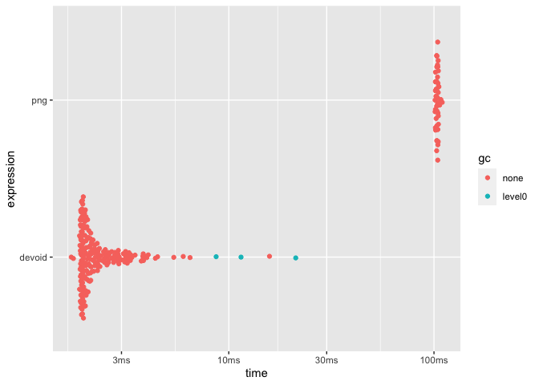

<!-- README.md is generated from README.Rmd. Please edit that file -->

# devoid

This package provides a graphic device that does no operations. This
makes it suitable for benchmarking functions that produce graphics as it
removes the device implementation from the equation. In contrast to the
`nulldev()` function from
[R.devices](https://github.com/HenrikBengtsson/R.devices) package this
device is a true device implementation that simply does nothing rather
than calling `pdf()` with a temporary file connection.

## Installation

You can install `devoid` with the remotes package:

``` r
# install.packages('remotes')
remotes::install_github('r-lib/devoid')
```

## Example

`devoid` provides a single function `void_dev()` which is used much like
any other device:

``` r
library(devoid)

void_dev()
plot(1:10, 1:10)
dev.off()
#> quartz_off_screen 
#>                 2
```

Using it we can now see how much drawing time e.g. the png device is
responsible for:

``` r
point_coord <- seq_len(1e4)
void_plot <- function() {
  void_dev()
  plot(point_coord, point_coord)
  dev.off()
  NULL
}
png_plot <- function() {
  png(tempfile())
  plot(point_coord, point_coord)
  dev.off()
  NULL
}

res <- bench::mark(devoid = void_plot(), png = png_plot(), min_iterations = 50)
plot(res)
```


